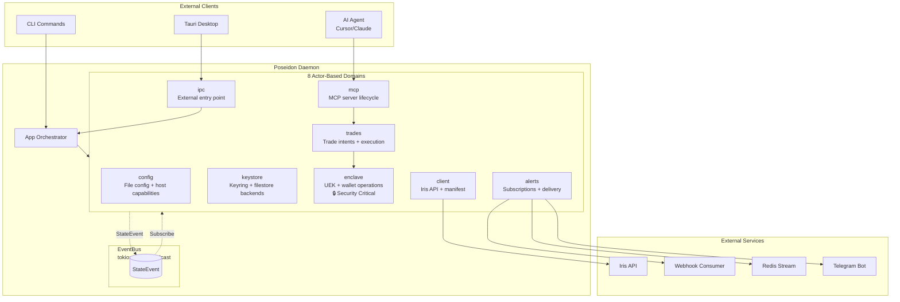

# Poseidon Daemon

Poseidon is the Edge Trade CLI and MCP (Model Context Protocol) server for blockchain trading and alerting. It provides secure wallet management, trade execution, and AI agent integration through an actor-based architecture.

**Package:** `@edgedottrade/mcp`  
**Binary:** `edge`  
**Entry Points:** `src/main.rs` (CLI), `src/lib.rs` (library API)

---

## Features

| Feature | Description | Domain |
|---------|-------------|--------|
| **Configuration Management** | XDG-compliant config with host capability detection | `config` |
| **Secure Key Storage** | OS keyring or password-encrypted filestore backends | `keystore` |
| **Wallet Operations** | EVM/SVM wallet creation, import, and secure signing | `enclave` |
| **API Client** | Iris API connection with auto-generated route handlers | `client` |
| **Trade Execution** | Intent-based trading with user confirmation flow | `trades` |
| **MCP Server** | Model Context Protocol server for AI agents | `mcp` |
| **Real-time Alerts** | Webhook, Redis, and Telegram alert delivery | `alerts` |
| **IPC Gateway** | External client entry point (Tauri, CLI-to-daemon) | `ipc` |

---

## Architecture



### Actor/Handler Pattern

Each domain follows a consistent 5-file structure:

```
domains/{domain}/
├── mod.rs          # Public exports, domain constants
├── handle.rs       # Thin gateway - public API, sends messages  
├── actor.rs        # State owner - business logic, receives messages
├── messages.rs     # Command/Query enums
├── errors.rs       # Domain-specific error types
└── state.rs        # Domain state structures
```

**Pattern Flow:**

```rust
// 1. External code calls handle method
let wallet = enclave_handle.create_wallet(chain, name).await?;

// 2. Handle sends message to actor via mpsc channel
let request = EnclaveRequest { payload, reply_to, trace_ctx };
sender.send(request).await?;

// 3. Actor receives and processes message
while let Some(req) = receiver.recv().await {
    let response = match req.payload { /* business logic */ };
    let _ = req.reply_to.send(response);
}
```

### EventBus - Central Communication

All inter-domain communication flows through `EventBus` using `StateEvent`:

```rust
use poseidon::event_bus::{EventBus, StateEvent};

// Publish events
let bus = EventBus::new(128);
bus.publish(StateEvent::SessionUnlocked)?;

// Subscribe to events
let mut rx = bus.subscribe();
while let Ok(event) = rx.recv().await {
    match event {
        StateEvent::WalletCreated { name, chain } => { /* ... */ }
        _ => {}
    }
}
```

---

## Domain Documentation

### 1. config Domain

**Purpose:** File-based configuration and host capability detection.

**State:**
```rust
pub struct ConfigState {
    pub config: AppConfig,              // From ~/.config/edge/config.toml
    pub host_capabilities: HostCapabilities,  // Detected at startup
}

pub struct HostCapabilities {
    pub keyring_available: bool,
    pub os: OperatingSystem,
    pub version: String,
}
```

**Responsibilities:**
- Load/save configuration from disk
- Detect host capabilities (keyring, OS features)
- Provide configuration values to other domains

**Events Published:**
- `ConfigLoaded`
- `ConfigChanged`

**Public API:**
```rust
use poseidon::domains::config::ConfigHandle;

let handle = ConfigHandle::new();
let _ = handle.load().await?;
let caps = handle.get_host_capabilities().await?;
```

---

### 2. keystore Domain

**Purpose:** Secure key storage backends (keyring + filestore).

**State:**
```rust
pub struct KeystoreState {
    pub backend: KeystoreBackend,
    pub status: KeystoreStatus,
}

pub enum KeystoreBackend {
    Keyring(KeyringStore),
    Filestore(FilestorePath),
}
```

**Responsibilities:**
- Store user encryption keys (UEK) securely
- Support keyring (preferred) and filestore (fallback)
- Lock/unlock key storage
- Derive keys from passwords (filestore mode)

**Events Published:**
- `KeystoreUnlocked`
- `KeystoreLocked`

**Public API:**
```rust
use poseidon::domains::keystore::KeystoreHandle;

let keystore = KeystoreHandle::new(&config, rx, event_bus).await?;
keystore.unlock(password).await?;
keystore.lock().await?;
```

---

### 3. enclave Domain

**Purpose:** Combined encryption (UEK) + wallet operations.

**Security Model:**
- **NEVER** keeps actual wallet material in memory permanently
- UEK only held temporarily during operations, then zeroized
- All sensitive data encrypted immediately after creation
- Encrypted blobs stored, never plaintext keys

**State:**
```rust
pub struct EnclaveState {
    pub uek: Option<UserEncryptionKeys>,  // Temporary only
    pub wallets: HashMap<String, WalletMetadata>,  // Metadata only
}

pub struct WalletMetadata {
    pub chain: ChainType,
    pub address: String,
    pub encrypted_key: Vec<u8>,  // Encrypted private key blob
}
```

**Responsibilities:**
- Temporary UEK access for wallet operations
- Wallet creation with immediate encryption
- Wallet import with secure key handling
- Trade intent signing with encrypted payloads

**Events Published:**
- `WalletCreated`
- `WalletImported`
- `WalletDeleted`
- `KeyMaterialZeroized`

**Public API:**
```rust
use poseidon::domains::enclave::{EnclaveHandle, ChainType};

let enclave = EnclaveHandle::with_session(event_bus, session).await?;

// Create wallet - private key is encrypted immediately
let wallet = enclave.create_wallet(ChainType::EVM, "my-wallet".to_string()).await?;

// List wallets - returns metadata only, no private keys
let wallets = enclave.list_wallets().await?;

// Sign trade intent - keys decrypted temporarily, then zeroized
let signed = enclave.sign_trade_intent(intent_id).await?;
```

---

### 4. client Domain

**Purpose:** Iris API client + manifest fetching/caching.

**State:**
```rust
pub struct ClientState {
    pub iris_client: Option<IrisClient>,
    pub manifest: Option<McpManifest>,
    pub manifest_refresh: Option<TaskHandle>,
}
```

**Responsibilities:**
- Connect to Iris API with API key
- Subscribe to real-time events
- Fetch and cache MCP manifest
- Background manifest refresh (60s interval)
- Host auto-generated API route handlers

**Events Published:**
- `ClientConnected`
- `ClientDisconnected`
- `ManifestLoaded`
- `ManifestUpdated`

**Public API:**
```rust
use poseidon::domains::client::ClientHandle;

let client = ClientHandle::new(event_bus);
client.connect(url, api_key, false).await?;
let manifest = client.get_manifest().await?;
```

---

### 5. trades Domain

**Purpose:** Trade intents + execution flow.

**State:**
```rust
pub struct TradesState {
    pub pending_intents: HashMap<u64, TradeIntent>,   // Awaiting confirmation
    pub active_trades: HashMap<u64, ActiveTrade>,   // Confirmed, in progress
    pub history: Vec<TradeRecord>,                    // Completed/cancelled
}

pub struct TradeIntent {
    pub id: u64,
    pub wallet_address: String,
    pub chain: ChainType,
    pub action: TradeAction,  // Swap, Transfer, etc.
    pub params: serde_json::Value,
    pub expires_at: Instant,
}
```

**Responsibilities:**
- Intent creation from MCP tool calls
- User confirmation workflow
- Intent signing orchestration with enclave
- Trade submission to Iris API
- Status tracking (pending → submitted → confirmed/failed)

**Events Published:**
- `TradeIntentCreated`
- `TradeIntentConfirmed`
- `TradeSubmitted`
- `TradeConfirmed`
- `TradeFailed`
- `TradeExpired`

**Public API:**
```rust
use poseidon::domains::trades::{TradesHandle, TradeAction};

let trades = TradesHandle::new(&client, &enclave, rx, event_bus).await?;

// Create intent - requires user confirmation
let intent = trades.create_intent(wallet, TradeAction::Swap { /* ... */ }).await?;

// Confirm and execute
let result = trades.confirm_intent(intent.id).await?;
```

---

### 6. mcp Domain

**Purpose:** MCP server lifecycle (stdio/HTTP).

**State:**
```rust
pub struct McpState {
    pub server: Option<EdgeServer>,
    pub mode: McpMode,
    pub transport: TransportType,
}

pub enum TransportType {
    Stdio,           // For AI agents (Cursor, Claude)
    Http { host: String, port: u16 },  // For web clients
}
```

**Responsibilities:**
- Start/stop MCP server
- Support stdio mode for AI agents
- Support HTTP mode for web clients
- Integrate with client domain for manifest and API calls

**Events Published:**
- `McpServerStarted`
- `McpServerStopped`

**Public API:**
```rust
use poseidon::domains::mcp::{McpHandle, TransportType};

let mcp = McpHandle::new(&client, &enclave, &trades, &alerts, rx, event_bus).await?;

// Start stdio server for AI agents
mcp.start_stdio().await?;

// Or start HTTP server
mcp.start_http("127.0.0.1", 3000).await?;
```

---

### 7. alerts Domain

**Purpose:** Real-time subscriptions + delivery (webhook/Redis/Telegram).

**State:**
```rust
pub struct AlertsState {
    pub subscriptions: HashMap<u32, SubscriptionInfo>,
    pub delivery: HashMap<u64, DeliveryConfig>,
}

pub enum DeliveryConfig {
    Webhook { url: String, secret: Option<String> },
    Redis { url: String, channel: String },
    Telegram { bot_token: String, chat_id: String },
}
```

**Responsibilities:**
- Subscribe to real-time events from client domain
- Route events to configured delivery targets
- Support webhook delivery with HMAC signature
- Support Redis stream delivery (XADD)
- Support Telegram bot delivery

**Events Published:**
- `SubscriptionCreated`
- `SubscriptionDeleted`
- `AlertDelivered`
- `AlertFailed`

**Public API:**
```rust
use poseidon::domains::alerts::{AlertsHandle, DeliveryConfig};

let alerts = AlertsHandle::new(&client, rx, event_bus).await?;

// Subscribe to procedure
alerts.subscribe("price_alert").await?;

// Register webhook delivery
alerts.register_delivery(DeliveryConfig::Webhook { url, secret }).await?;
```

---

### 8. ipc Domain

**Purpose:** External entry point for Tauri and CLI-to-daemon communication.

**State:**
```rust
pub struct IpcState {
    pub server: Option<IpcServer>,
    pub connections: HashMap<ConnectionId, IpcConnection>,
    pub domain_gateways: DomainGatewayRegistry,
}

pub struct DomainGatewayRegistry {
    pub config_tx: mpsc::Sender<ConfigRequest>,
    pub keystore_tx: mpsc::Sender<KeystoreRequest>,
    pub enclave_tx: mpsc::Sender<EnclaveRequest>,
    pub client_tx: mpsc::Sender<ClientRequest>,
    pub trades_tx: mpsc::Sender<TradesRequest>,
    pub mcp_tx: mpsc::Sender<McpRequest>,
    pub alerts_tx: mpsc::Sender<AlertsRequest>,
}
```

**Responsibilities:**
- Entry point for external requests (Tauri UI, CLI-to-daemon)
- Protocol translation (JSON-RPC ↔ internal messages)
- Access control enforcement
- Direct mpsc routing to domains
- EventBus forwarding to connected clients

**Events Published:**
- `IpcClientConnected`
- `IpcClientDisconnected`
- `IpcRequestReceived`

**Public API:**
```rust
use poseidon::domains::ipc::{IpcHandle, create_ipc_handle};

let (ipc, _task) = create_ipc_handle(domain_gateways, event_bus);

// Start IPC server
ipc.start(IpcListener::WebSocket { host, port }).await?;
```

---

## Quick Start

### Prerequisites

- Rust 1.85+ (2024 edition)
- Linux/macOS (keyring support varies by OS)

### Build

```bash
# From repo root
yarn build --filter=@edgedottrade/mcp

# Or directly with Cargo
cd pkg/poseidon
cargo build --release
```

### Basic Usage

```bash
# Create a new key (interactive)
edge key create

# Unlock session
edge key unlock

# Create wallet
edge wallet create --chain EVM --name "my-wallet"

# Start MCP server (stdio mode for AI agents)
edge serve --stdio

# Start MCP server (HTTP mode)
edge serve --host 127.0.0.1 --port 3000
```

### Daemon Mode

```bash
# Start daemon
edge --daemon

# In another terminal, CLI commands connect via IPC
edge wallet list
edge trade status --intent-id 1
```

---

## Security

### UEK Handling (Critical)

The **User Encryption Key (UEK)** is the root of trust:

| Principle | Implementation |
|-----------|----------------|
| UEK never held permanently | `Option<UserEncryptionKeys>` cleared after use |
| Keys zeroized after use | `zeroize::ZeroizeOnDrop` trait on `SensitiveBytes` |
| Enclave-only access | Only `enclave` domain touches UEK |
| Encrypted blobs only | Private keys stored as encrypted blobs |

### Secure Flow

```rust
// 1. User provides password → Keystore derives UEK
let uek = keystore.unlock(password).await?;

// 2. Enclave requests UEK temporarily for operation
let uek = session.get_user_encryption_key()?;

// 3. Enclave creates wallet, encrypts with UEK
let wallet = create_wallet_with_uek(chain, name, &uek)?;
let encrypted_blob = wallet.encrypted_private_key;

// 4. Original key material is zeroized
private_key.zeroize();

// 5. Only encrypted blob persists
store.save(encrypted_blob)?;
```

---

## Project Structure

```
pkg/poseidon/
├── Cargo.toml              # Rust package manifest
├── package.json            # NPM wrapper for MCP distribution
├── build.rs                # Build script for code generation
├── src/
│   ├── main.rs             # CLI entry point
│   ├── lib.rs              # Library exports
│   ├── app/                # CLI application (parsing, runner)
│   ├── commands/           # CLI command implementations
│   ├── domains/            # 8 actor-based domains
│   │   ├── alerts/
│   │   ├── client/
│   │   ├── config/
│   │   ├── enclave/
│   │   ├── ipc/
│   │   ├── keystore/
│   │   ├── mcp/
│   │   └── trades/
│   ├── event_bus/          # Central communication
│   ├── session/            # Session management (legacy)
│   ├── state/              # Global state (EdgeState)
│   ├── wallet/             # Wallet types + operations
│   ├── manifest/           # MCP manifest handling
│   ├── generated/          # Auto-generated tRPC routes
│   └── messages/           # Console output + errors
└── bin/                    # Binary wrapper scripts
```

---

## See Also

- [USAGE.md](USAGE.md) - CLI usage guide and command reference
- [API.md](/docs/trade.edge/trade.edge.engineering/systems/poseidon/API.md) - Library API reference
- [Architecture](/docs/trade.edge/trade.edge.engineering/systems/poseidon/architecture.md) - System design
- [EventBus](src/event_bus/mod.rs) - EventBus implementation

**Related packages:** [pkg/lib](../lib/), [pkg/charon](../charon/) (Iris client types)
