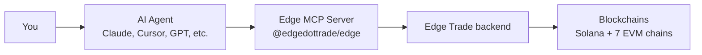

# Edge for Agents

MCP server for blockchain trading and market intelligence. 39 actions across 6 namespaces (`intelligence`, `tokens`, `pairs`, `wallet`, `orders`, `agent`). Supports 8 chains: Solana, Ethereum, Base, Arbitrum, BSC, Optimism, Avalanche, Blast.

## How it fits together



Your agent talks to the Edge MCP server using the Model Context Protocol. The MCP server authenticates to the Edge platform with your API key and relays requests to the right chain.

## Install

```bash
npx -y @edgedottrade/edge --api-key $EDGE_API_KEY
```

The npm package downloads the native Rust binary for your platform on first run.

## What you get

| Namespace | Tool | Actions | What it does |
|-----------|------|---------|-------------|
| `intelligence` | search | `search_tokens`, `screen_tokens`, `search_swaps` | Find tokens, screen markets, look up transactions |
| `tokens` | inspect | `token_info_with_pricing`, `token_top_holders`, `token_top_traders`, `token_dev_tokens` | Token details, holder analysis, trader rankings, deployer history |
| `pairs` | pairs | `pair_metrics`, `pair_ohlcv`, `pair_swaps`, `pair_info` | Price data, candlesticks, swap history, pool info |
| `wallet` | portfolio | `wallet_holdings`, `wallet_summary`, `wallet_swaps`, `wallet_history`, `native_balances` | Holdings, PnL, trade history, balances |
| `orders` | trade | `place_limit_order`, `place_spot_order`, `list_orders`, `order`, `cancel_order`, `cancel_all_orders` + 10 strategy actions | Place orders, manage strategies (entry/exit DCA, TP/SL) |
| `agent` | agent | 7 wallet-encryption actions | Encrypted wallet management for the semi-custodial trading flow |

## How calls work

Tool name = namespace. Arguments: `{"action": "ACTION_NAME", "schema": 1, "data": {...}}`

```json
{"action": "search_tokens", "schema": 1, "data": {"search": "PEPE", "chainId": "solana"}}
```

Response: `JSON.parse(result.content[0].text)`

## Common workflows

**Price check before trade:**
1. `tokens` > `token_info_with_pricing` (get pair address + current price)
2. `pairs` > `pair_metrics` (volume, buy/sell ratio)
3. `orders` > `place_limit_order` or `place_spot_order` (place order)

**Token investigation:**
1. `tokens` > `token_info_with_pricing` (price, mcap, pair)
2. `tokens` > `token_top_holders` (insider/sniper flags)
3. `tokens` > `token_top_traders` (who profited)
4. `tokens` > `token_dev_tokens` (deployer history)
5. `pairs` > `pair_ohlcv` (chart data)

**Wallet analysis:**
1. `wallet` > `wallet_summary` (PnL overview)
2. `wallet` > `wallet_holdings` (all positions)
3. `wallet` > `wallet_history` (PnL time series)
4. `wallet` > `native_balances` (SOL/ETH balances)

**Token screening:**
1. `intelligence` > `screen_tokens` (Solana only, 30+ filters)
2. Loop results through `token_info_with_pricing` for live pricing

## Critical gotchas

| # | Gotcha | Rule |
|---|--------|------|
| 1 | `screen_tokens` data is an array | Pass `data: [{...}]` not `data: {...}` |
| 2 | `wallet_holdings` and `list_orders` wrap results | Unwrap with `data.items` |
| 3 | `pair_metrics` returns all intervals | Access `data["24h"].volumeUsd`, not `data.volumeUsd` |
| 4 | `native_balances` is nested | `balances.solana.ADDR` = lamports string, divide by 1e9 |
| 5 | `list_orders` requires status + type | Omit (don't null) optional fields like `chainId` |
| 6 | `pair_ohlcv` timestamps are milliseconds | Not seconds |
| 7 | `pair_metrics`, `pair_ohlcv`, `pair_info` use `pairChainId` + `pairContractAddress` | But `pair_swaps` uses `chainId` + `pairAddress` |
| 8 | `place_limit_order` requires a trigger; `place_spot_order` requires an `envelope` | Both wrap fields under `order` |
| 9 | No `side` field in swaps | Check `tokensBought > "0"` for buy, `tokensSold > "0"` for sell |
| 10 | `wallet_history` field is `walletDetails` | Not `details` (silent empty return if wrong) |
| 11 | `wallet_summary` has no `totalPnlUsd` | Calculate: `totalSoldUsd + remainingUsd - totalCostUsd` |
| 12 | `screen_tokens` is Solana-only | chainId filter silently ignored on EVM |

## Chain IDs

| Chain | ID | Type |
|-------|----|------|
| Solana | `"solana"` | String |
| Ethereum | `1` | Number |
| Base | `8453` | Number |
| Arbitrum | `42161` | Number |
| BSC | `56` | Number |
| Optimism | `10` | Number |
| Avalanche | `43114` | Number |
| Blast | `81457` | Number |

Solana uses a string. All EVM chains use numbers. See [Chains](chains.md) for details.

## Links

- [Quick Start](quick-start.md) - Install and configure
- [Concepts](concepts.md) - Token, pair, order, strategy, chain IDs
- [Authentication](authentication.md) - API key setup
- [Tools](tools/README.md) - All 6 tools with parameters and examples
- [Frameworks](frameworks/README.md) - Claude Code, Gemini CLI, Codex CLI, Cursor, VS Code, Zed, Cline, Goose, OpenAI Agents SDK, LangChain, and more
- [Plugins](plugins/claude.md) - Claude Desktop, OpenClaw skill bundles
- [Agent Patterns](agent-patterns.md) - 6 atomic patterns
- [Cookbook](cookbook.md) - End-to-end recipes (DCA bot, whale watching, safety audit, copy-trade, more)
- [REST API](rest-api.md) - Use Edge from ChatGPT Custom GPTs, Gemini, Zapier, or any HTTP client
- [Errors](errors.md) - Error codes and retry guidance
- [Subscriptions](subscriptions.md) - Real-time alerts via webhook, Redis stream, or Telegram
- [Redis stream delivery](redis-streams.md) - Push events onto a Redis stream for async consumption
- [Webhooks](webhooks.md) - HTTP delivery with HMAC-SHA256 signature verification
- [CLI Reference](cli-reference.md) - Command-line usage
- [GitHub](https://github.com/edgetrade/edge) - Source code
