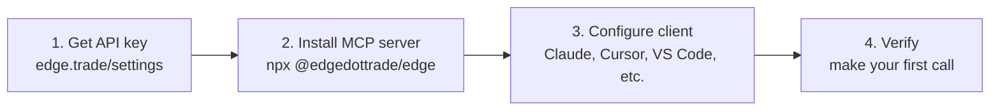

# Quick Start

Get the Edge MCP server running in your AI client in four steps.



## Installation

### Option 1: npm (recommended)

```bash
npx -y @edgedottrade/edge --help
```

The npm package downloads the native Rust binary for your platform on first run. The installed binary is called `edge`.

### Option 2: From source

```bash
git clone https://github.com/edgetrade/edge.git
cd edge
cargo build --release
```

The built binary is at `./target/release/edge`. Pass `--api-key sk-...` to run it.

## Get API Key

Visit [https://edge.trade/settings/api-keys](https://edge.trade/settings/api-keys) to create an API key.

## Configuration

### Claude Desktop

```json
{
  "mcpServers": {
    "edge": {
      "command": "npx",
      "args": ["-y", "@edgedottrade/edge", "--api-key", "sk-your-key-here"]
    }
  }
}
```

If you built from source, point at the binary directly:

```json
{
  "mcpServers": {
    "edge": {
      "command": "/path/to/edge",
      "args": ["--api-key", "sk-your-key-here"]
    }
  }
}
```

### Cursor

Add to your MCP settings:

```json
{
  "mcpServers": {
    "edge": {
      "command": "npx",
      "args": ["-y", "@edgedottrade/edge", "--api-key", "sk-your-key-here"]
    }
  }
}
```

### Continue

Add to your `config.json`:

```json
{
  "mcpServers": {
    "edge": {
      "command": "npx",
      "args": ["-y", "@edgedottrade/edge", "--api-key", "sk-your-key-here"]
    }
  }
}
```

## Key Management

The `edge` CLI automatically detects if your OS keyring is available and uses it by default. If unavailable, it falls back to file-based storage.

```bash
# Create key (auto-detects keyring or file storage)
edge key create

# Verify key exists
edge key unlock

# Remove key
edge key lock

# Generate new key
edge key update
```

### Override Config Location

```bash
# Use custom config file
edge --config /path/to/config.toml key create

# Or via environment variable
export EDGE_CONFIG=/path/to/config.toml
edge key create
```

### Force Storage Mode

Edit `~/.config/edge/config.toml`:

```toml
[session]
use_keyring = true   # Force OS keyring
# use_keyring = false  # Force file storage
```

Remove the line to re-trigger auto-detection.

## First Tool Call

Test the installation:

```bash
npx -y @edgedottrade/edge --api-key sk-your-key-here help search
```

Or if you built from source:

```bash
./target/release/edge --api-key sk-your-key-here help search
```

Once your AI client is configured, just ask it:

```md
Search for tokens on Base
```
