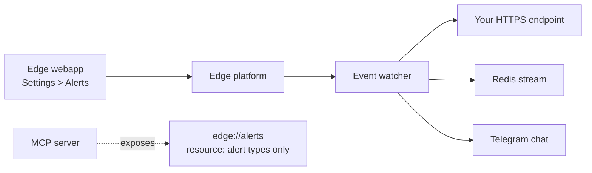

# alerts

Real-time alert subscriptions for market, wallet, and order events. Edge supports push delivery to webhook, Redis stream, or Telegram.


Alert registration is **configured in the Edge webapp** (Settings > Alerts), not via MCP actions. The MCP server exposes the catalog of available alert types as a read-only resource at `edge://alerts`, but registration / listing / cancellation of alerts happens through the webapp UI.


## How the system fits together



Use the MCP `edge://alerts` resource from your agent to read the **catalog** of alert types your account can subscribe to. Configure the actual subscription (and delivery target) in the webapp.

## Reading the alert catalog from MCP

The `edge://alerts` resource returns the available alert types and the input schema each one requires. From a typical MCP client:

```text
resource: edge://alerts
```

A minimal example using JSON-RPC over stdio:

```json
{"jsonrpc":"2.0","id":3,"method":"resources/read","params":{"uri":"edge://alerts"}}
```

Parse the response to enumerate alert names and required `input` fields.

## Alert types (catalog)

The live catalog ships in `edge://alerts`. At time of writing the platform exposes:

| Alert name | What it streams |
|---|---|
| `on_pair_updates` | Pair price, liquidity, volume (`type: "metrics"`) or pair state (`type: "state"`) |
| `on_pair_swaps` | Every swap on a specific pair |
| `on_wallet_swaps` | Every swap on one or more wallet addresses |
| `on_token_updates` | Token events, e.g. `type: "holders"` for holder distribution changes |
| `on_portfolio_updates` | Wallet holdings changes as buys/sells/transfers are detected |
| `on_order_updates` | Order status: fills, cancellations, rejections |
| `on_memescope` | Live Memescope token discoveries |

Verify against `edge://alerts` for the current set and per-alert input schemas.

## Delivery targets

Configure one of three delivery targets per alert in the webapp:

- **Webhook** — POST each event to an HTTPS endpoint with HMAC signature verification. See [Webhooks](../webhooks.md).
- **Redis stream** — push each event onto a Redis stream your backend consumes. See [Redis stream delivery](../redis-streams.md).
- **Telegram** — send formatted notifications to a chat or group.

The delivery side is documented per channel; the receiver-side payload shape and verification code is the same regardless of how the alert was registered.

## Polling alternatives from MCP

If you want event-driven behavior **inside an agent** without running a separate webhook receiver, poll the relevant action on a cadence:

| Need | Poll this action |
|---|---|
| Wallet swaps | `wallet.wallet_swaps` |
| Pair swaps | `pairs.pair_swaps` |
| Pair metrics | `pairs.pair_metrics` |
| Order status | `orders.list_orders` (filter by `status` and `taskIds`) |
| Holdings change | `wallet.wallet_holdings` |

Diff each result against the previous poll and act on what changed. Cadence depends on latency budget and rate limits — 10–30 s is reasonable for active wallets and pairs. See [Errors: Rate limits](../errors.md#rate-limiting).

## Related

- [Subscriptions](../subscriptions.md): delivery-mode overview
- [Webhooks](../webhooks.md): webhook delivery with HMAC verification
- [Redis stream delivery](../redis-streams.md): consume events from a Redis stream
- [Errors](../errors.md): subscription error codes
